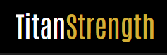

# Titan Strength

# Description

Titan Strength is a (fictional) web application with the purpose of allowing users to purchase a range of gym equipment designed primarily for strength training. The focus of the products displayed is on the bread and butter basics of powerlifting/strongman type training, barbells, plates and dumbells.

# Inspiration and credit

I created this site based off the code institute mini project "Boutique Ado". I followed the same basic framework and used it heavily for inspiration and guidance.

I borrowed my products from https://www.strengthshop.co.uk/ as this is a site I have used many times in the past and since this project will not be used commercially these product served as a suitable demonstration of the concepts learned so far.

# Deployment and Demo

It has been deployed to heroku and can be viewed [here](https://titan-strength.herokuapp.com/).

The deployment process is shown below:

[- First you need to sign up for a Heroku account, if you already have an account just log in](/readmelinks/requirements.png)  
[- Next use the echo command to create a procfile, this tells heroku which file runs the app](/readmelinks/procfile.png)  
[- login to heroku and on the dashboard click create a new app](/readmelinks/create.png)  
[- name your app and select the region, the standard syntax is lower case letters seperated by dashes. Click create app.](/readmelinks/name-app.png)  
[- to connect the app to heroku I used automatic deployment from github. First go to the deploy tab](/readmelinks/deploy-tab.png)  
[- scroll down, select github as the deployment method, search for your repo name in the "app connected to github" section and once it finds it click connect. ](/readmelinks/connect.png)  
[- now you can enable automatic deploys which will build your app](/readmelinks/auto.png)  
[- for the site to work all your environment variables must be included on heroku. This image explains each variable.](/readmelinks/configvars.png)  

- This will generate a live page for your app.

# User experience

## Goals and Aims

This project is designed with the goal of allowing users to purchase strength training related products in a user friendly and straightforward manner.

## User Stories

-   As a user, I want to be able to search the site by keyword for products that I already know I want.
-   As a user, I want to be able to browse through products by category and also filter these products, for example by rating or price.
-   As a user, I want to be able to view all of my previous orders.
-   As a user, I want to be able to choose the quantity of each product I intend to order and also adjust this in my shopping bag when necessary.
-   As a user, I want to be able to pay for these items via secure credit card payment.
-   As a vendor, I want to be able to add and remove products via a user interface on the site.
-   As a user, I want to be able to create an account to store my delivery information.

## Wireframes

Using these goals as a guide I drew up some wireframes as an initial design using MS paint.

[- home page](/readmelinks/homepage.png)  
[- products page](/readmelinks/products.png)  
[- profile page](/readmelinks/profile.png)  
[- shopping bag page](/readmelinks/shopping-bag.png)  
[- log in page](/readmelinks/login.png)  
[- registration page](/readmelinks/register.png)  
[- product management page](/readmelinks/prodman.png)  
[- checkout page](/readmelinks/checkout.png)  

The final design was largely the same as the wireframes I had created with the addition of bootstrap toasts and a few pages such as the "checkout success" page, "forgotten password" page, "sign out" page and probably most importantly the product information page.

Here is the final list of pages after these changes

- Home page page: Contains a background image to convey the theme of the site and a call to action that links to the products page.
- Products page: There are various iterations of the products page showing different categories of products or just those categories filtered by price, rating etc. The function is to display products to entice the user to purchase
- The product info page: Provides the user information regarding a selected product and the link to add to bag.
- The login page: Contains a form to allow existing users to log in.
- The registration page: Contains a form to allow new users to sign up.
- The shopping bag: Allows users to store products, adjust quantities, view the previously selected products and a link to buy products.
- The profile  page: Once logged in the user has access to the profile page which displays all the previous orders and allows the user to view or edit their delivery information.
- The checkout page: Allows the user to purchase items using credit card payments.
- The checkout success page: Provides the user confirmation of their order.
- The add product page: If logged in as a superuser this will allow the user to add products.
- The edit product page: If logged in as a superuser this will allow the user to edit products.
- The sign out page page: Asks the user if they are sure they want to sign out.
- The forgotten password page: Allows the user to retrieve their password.

# Visual Identity

- The color scheme I decided on was black, white and gold. I implemented a dark grey and black navigation area because I think its easy on the eyes and then contrasted that with white and gold to make the key areas stand out. I wanted this to be more subtle than my previous projects and convey a more sophisticated theme hence the gold.

# Typography

I used Antonio as my standard font across the site as in most cases I find it stands out and fits the theme of the site but in some cases it was hard to read so I opted for Montserrat in those cases.

# Features

## Registration

-   New users can register for an account by crerating a username and password
-   For the account to be created, all fields must pass validation:
    -   Username must be less than 30 characters
    -   Password can use any characters but must be between 6 and 15 characters in length

## Log in

-   Existing users can log in via their username and password
-   All fields must pass validation
-   While logged in users can view there previous orders.
-   if logged in as a "superuser" then the user can add, edit and delete products via the product management page.
-   Users can log out and close the session

## Add to bag

-   Users can select a quantity and add items to their shopping bag
-   Users can update the quantity via the shopping bag page

## Checkout

-   Users can checkout and purchase their chosen items via stripe credit card payment system
-   If the User is logged in and has save info checked as true then the delivery information is saved to the profile. 

# Security

The following security measures were implemented

-   
-   Data validation was used to ensure that only valid data is able to be submitted. The solution I used here was inspired by another code institute students project which can be found here: https://github.com/LukeGarnham/Wired-and-Wiser-MS3

# Validation and code clean up

- I used W3C mark up validation service to validate my code [W3C Markup Validator](https://validator.w3.org/)  
- I used freeformatter.com's HTML formatter to format all my code [freeformatter HTML Formatter](https://www.freeformatter.com/html-formatter.html)  
- I used freeformatter.com's CSS beautifier to beautify all my CSS [freeformatter CSS Beautifier](https://www.freeformatter.com/css-beautifier.html)  
- I used the command "python3 -m flake8" to bring up a list of linting errors which I worked through and remedied where necessary  

# Features to be implemented in future updates

-   Pagination will be required when more products are added.
-   A warning message before products are deleted.
-   Paypal functionality

# Technologies Used

-   HTML
-   CSS
-   Bootstrap
-   JavaScript / JQuery
-   Python
-   Django
-   Amazon web services
-   Stripe
-   Font awesome

# Media

I have used different resources for the API images and my logo, I'll list all below:

- [Pexels](https://www.pexels.com/) for the images used throughout the site.
    - https://www.pexels.com/photo/several-rogue-gym-plates-1092878/  (Main page image)
    - https://www.pexels.com/photo/silver-dumbbells-on-black-steel-rack-4164766/  (Shopping bag photo)
    - https://www.pexels.com/photo/black-barbell-685530/  (Deadlift image)
- [Font Awesome](https://fontawesome.com/6?next=%2Fstart) for the various icons used throughout the site
- [favicon.io](https://favicon.io/favicon-generator/) for the favicon

# Testing

I have created a full manual testing document which can be found [here](TESTING.md).

Website has been tested using GTmetrix see results below:

[- GT Metrix test results screenshot](/readmelinks/gtmetrix.png)  

- [full test results](https://gtmetrix.com/reports/vg-review.herokuapp.com/pNiXfCRh/)

The page has a fully loaded time of 2.5 seconds which can be improved in further updates by resizing the images I have used to closer to their final size as suggested in the summary.

# Thanks to

- My Mentor, Felipe Alarcon, who has been excellent from the start and a massive part of my continued development as a coder
- The code institute tutor team who have got me through every technical difficulty that was too much to figure out on my own.
- Font awesome community for developing this great resource
- Bootstrap developers for the great resource and documentation
- Python developers for designing and maintaining my favourite coding language so far
- Django developers for creating a very powerful and impressive framework

# License

This project is licensed under the [MIT](https://choosealicense.com/licenses/mit/) license.

Copyright 2021 Joshua Connor Hunt.

Permission is hereby granted, free of charge, to any person obtaining a copy of this software and associated documentation files (the "Software"), to deal in the Software without restriction, including without limitation the rights to use, copy, modify, merge, publish, distribute, sublicense, and/or sell copies of the Software, and to permit persons to whom the Software is furnished to do so, subject to the following conditions:

The above copyright notice and this permission notice shall be included in all copies or substantial portions of the Software.

THE SOFTWARE IS PROVIDED "AS IS", WITHOUT WARRANTY OF ANY KIND, EXPRESS OR IMPLIED, INCLUDING BUT NOT LIMITED TO THE WARRANTIES OF MERCHANTABILITY, FITNESS FOR A PARTICULAR PURPOSE AND NONINFRINGEMENT. IN NO EVENT SHALL THE AUTHORS OR COPYRIGHT HOLDERS BE LIABLE FOR ANY CLAIM, DAMAGES OR OTHER LIABILITY, WHETHER IN AN ACTION OF CONTRACT, TORT OR OTHERWISE, ARISING FROM, OUT OF OR IN CONNECTION WITH THE SOFTWARE OR THE USE OR OTHER DEALINGS IN THE SOFTWARE.